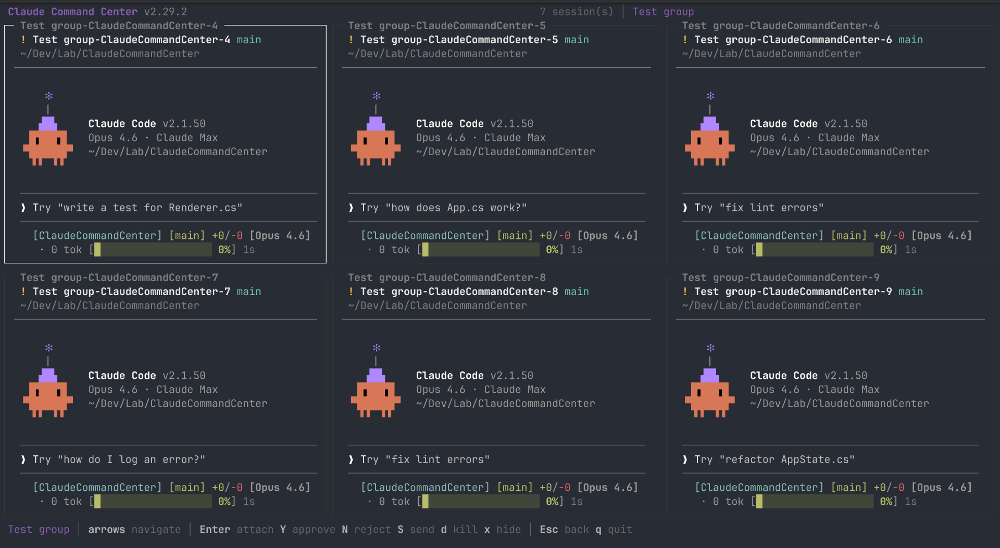
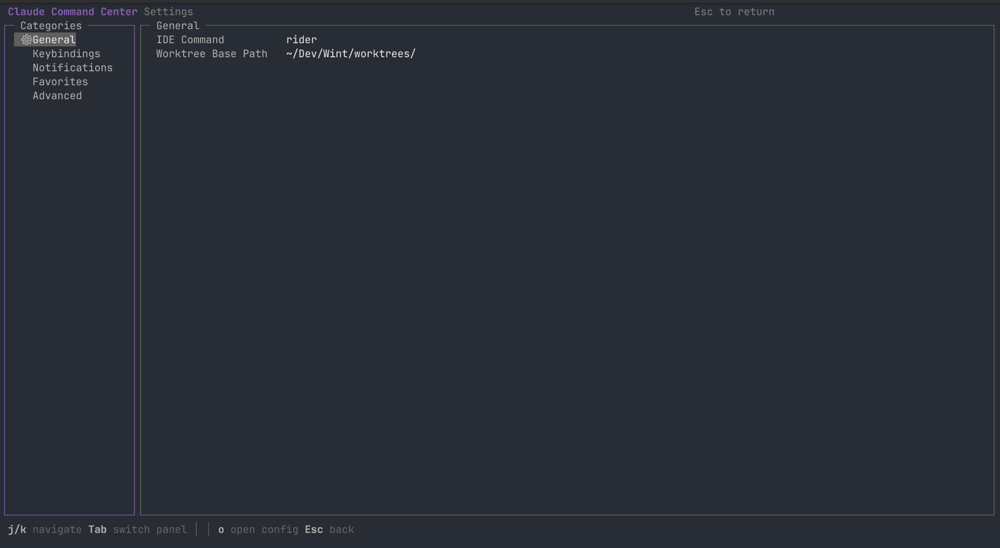
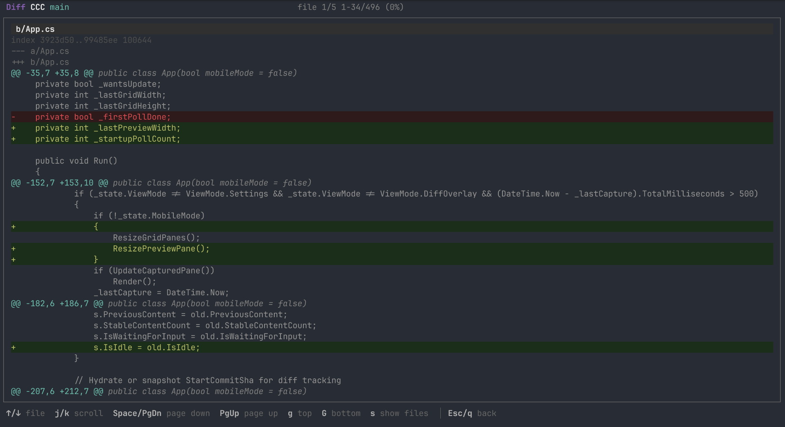
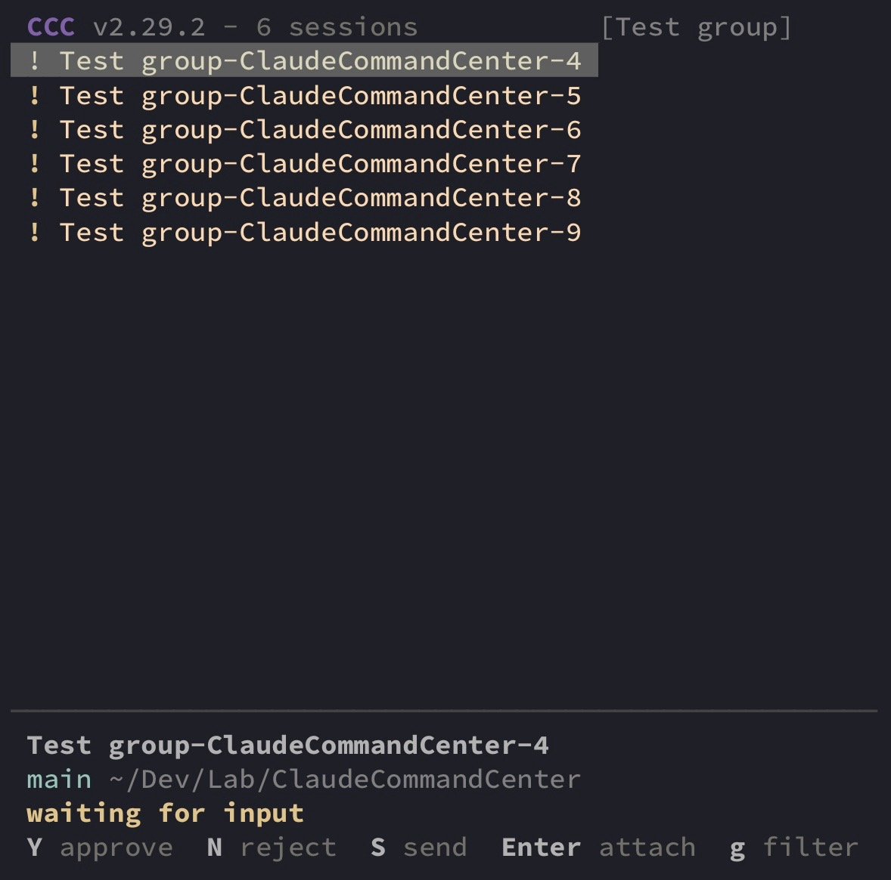

# Claude Command Center (ccc)

### List View


### Grid View



### Settings



### Diff View



A terminal UI for managing multiple Claude Code sessions. Run dozens of Claude agents in parallel, see what they're all doing at a glance, and jump into any session instantly.

## Features

- **Live preview** — see each session's terminal output in real-time without attaching
- **Grid view** — monitor up to 9 sessions simultaneously in an auto-scaling grid
- **Waiting-for-input detection** — sessions that need your attention are marked with `!` and trigger notifications
- **Session groups** — organize related sessions together, create them in bulk from git worktrees
- **Git worktree integration** — create worktrees on the fly, one branch per session, shared feature folders with auto-discovery
- **Git diff view** — see what changed since a session started, with full colorized scrollable diff overlay
- **Notifications** — terminal bell, OSC, and desktop notifications when sessions go idle
- **Cross-platform** — tmux on Linux/macOS (sessions persist), native ConPTY on Windows (no WSL needed)
- **Mobile mode** — single-column layout for SSH from your phone
- **Customizable keybindings** — rebind any action, disable what you don't need, all from the in-app settings page
- **IDE integration** — open any session's directory in your editor with one keypress
- **Auto-update** — checks GitHub for new releases and installs in-place
- **Single binary, single dependency** — just .NET 10 and tmux (or Windows 10+)

## Requirements

| Platform        | Backend | Requirements                                                                     |
|-----------------|---------|----------------------------------------------------------------------------------|
| Linux / macOS   | tmux    | [.NET 10](https://dotnet.microsoft.com/download), [tmux](https://github.com/tmux/tmux) |
| Windows         | ConPTY  | [.NET 10](https://dotnet.microsoft.com/download), Windows 10 1809+              |
| Windows (WSL2)  | tmux    | [.NET 10](https://dotnet.microsoft.com/download), tmux (inside WSL)              |

On Linux and macOS, CCC uses tmux as the session backend — sessions persist independently of CCC. On Windows, CCC uses
the native ConPTY (pseudoconsole) API — no WSL or tmux required, but sessions are tied to the CCC process.

## Build

```bash
dotnet build
```

## Install

### From GitHub Release

Download and install the latest release automatically (Linux / macOS):

```bash
curl -fsSL https://raw.githubusercontent.com/AdamGardelov/ClaudeCommandCenter/main/install.sh | bash
```

This detects your platform (Linux, macOS Intel/ARM), downloads the latest release, and installs to `/usr/local/bin`.

Windows (PowerShell):

```powershell
irm https://raw.githubusercontent.com/AdamGardelov/ClaudeCommandCenter/main/install.ps1 | iex
```

This downloads the latest release and installs to `%LOCALAPPDATA%\Programs\ccc`, adding it to your PATH automatically.

### From Source

Requires [.NET 10](https://dotnet.microsoft.com/download) SDK.

```bash
# Linux / WSL
dotnet publish -c Release -r linux-x64 --self-contained -p:PublishSingleFile=true -o dist

# macOS Apple Silicon
dotnet publish -c Release -r osx-arm64 --self-contained -p:PublishSingleFile=true -o dist

# macOS Intel
dotnet publish -c Release -r osx-x64 --self-contained -p:PublishSingleFile=true -o dist

# Windows
dotnet publish -c Release -r win-x64 --self-contained -p:PublishSingleFile=true -o dist
```

Then copy to your PATH:

```bash
# Linux / macOS
sudo cp dist/ccc /usr/local/bin/ccc

# Windows (PowerShell) — copy to a directory in your PATH
Copy-Item dist\ccc.exe "$env:LOCALAPPDATA\Microsoft\WindowsApps\ccc.exe"
```

After installing, the `ccc` command is available from any terminal.

## Usage

Run outside of tmux:

```bash
ccc
```

The app shows a split-panel TUI — sessions on the left, a live pane preview on the right. Sessions that have been idle
for a few seconds are marked with `!` (waiting for input).

### Windows (ConPTY)

On Windows, CCC uses the native ConPTY pseudoconsole API. No WSL, no tmux — just run `ccc` in Windows Terminal,
PowerShell, or cmd.

Key differences from the tmux backend:

- **Sessions are ephemeral** — closing CCC ends all sessions. tmux sessions persist independently; ConPTY sessions don't.
- **Detach with `Alt+Q`** — press Alt+Q to return to the dashboard.
- **No status bar color** — tmux shows colored session status bars; on Windows, color is shown in CCC's own UI.
- **Requires Windows 10 1809+** (build 17763) for ConPTY support.

### Mobile Mode

For SSH clients on phones (e.g. Termius), launch with the `-m` flag:

```bash
ccc -m
```

Mobile mode uses a single-column layout optimized for narrow terminals — no preview panel, no grid view. You get a
scrollable session list, a 3-line detail bar for the selected session, and a context-sensitive status bar.

<p>
  
  
</p>

| Key                | Action                                           |
|--------------------|--------------------------------------------------|
| `j` / `k` / arrows | Navigate sessions                                |
| `Enter`            | Attach to selected session                       |
| `Y`                | Approve (shown when session is waiting)          |
| `N`                | Reject (shown when session is waiting)           |
| `S`                | Send text to session                             |
| `g`                | Cycle group filter (All > Group1 > Group2 > All) |
| `r`                | Refresh session list                             |
| `q`                | Quit                                             |

### Grid View

Press `G` to toggle a grid view that displays all sessions as rich panels in an auto-scaling grid. Each cell shows the
session name, status, git branch, working directory, and live pane output.

The grid auto-scales based on session count:

| Sessions | Layout                  | Output lines per cell |
|----------|-------------------------|-----------------------|
| 1        | 1x1                     | ~30 lines             |
| 2        | 1x2                     | ~15 lines             |
| 3–4      | 2x2                     | ~10 lines             |
| 5–6      | 2x3                     | ~5 lines              |
| 7–9      | 3x3                     | ~3 lines              |
| 10+      | Falls back to list view |

Press `Enter` on a grid cell to **focus** it — keystrokes are forwarded directly to the session while the grid stays
visible. Press `Escape` to unfocus, or `Ctrl+Arrow` to switch between cells while staying focused. Press `G` to switch
back to list view.

### Keybindings

#### List View (default)

| Key                | Action                                                           |
|--------------------|------------------------------------------------------------------|
| `j` / `k` / arrows | Navigate sessions                                                |
| `Enter`            | Attach to selected session                                       |
| `G`                | Toggle grid view                                                 |
| `D`                | Toggle git diff mode (summary in preview, `Enter` for full diff) |
| `n`                | Create new session (launches `claude` in a given directory)      |
| `g`                | Create new group                                                 |
| `f`                | Open session directory in file manager                           |
| `i`                | Open session directory in IDE                                    |
| `s`                | Open settings page                                               |
| `d`                | Delete session (with confirmation)                               |
| `e`                | Edit session (name, description, color)                          |
| `x`                | Exclude/restore session from grid view                           |
| `m`                | Move standalone session to a group                               |
| `r`                | Refresh session list                                             |
| `Y`                | Approve — sends `y` to the selected session                      |
| `N`                | Reject — sends `n` to the selected session                       |
| `S`                | Send — type a message and send it to the selected session        |
| `q`                | Quit                                                             |

#### Grid View

| Key               | Action                                         |
|-------------------|------------------------------------------------|
| `↑` `↓` `←` `→`  | Navigate grid cells                            |
| `Enter`           | Focus cell — type directly into the session    |
| `Escape`          | Unfocus — return to grid navigation            |
| `Ctrl+Arrows`     | Switch cells while focused                     |
| `G`               | Back to list view                              |
| `Y` / `N` / `S`   | Approve, reject, send (same as list view)      |
| `q`               | Quit                                           |

Arrow keys always work for navigation regardless of configuration. When you attach to a session, detach to return to the
command center:

| Platform      | Detach shortcut |
|---------------|-----------------|
| Linux / macOS | `Ctrl-b d` (standard tmux detach) |
| Windows       | `Alt+Q` |

### Git Diff View

Press `D` to toggle diff mode. When active, the preview panel shows a `git diff --stat` summary of all changes since the
session started (auto-refreshes every 5 seconds). Press `Enter` while diff mode is on to open a fullscreen scrollable
overlay with the complete colorized diff.

CCC records each session's HEAD commit at creation time as a baseline. All diffs are computed against this baseline, so
you see exactly what changed during the session.

#### Diff Overlay Controls

| Key                   | Action          |
|-----------------------|-----------------|
| `j` / `k` / `↑` / `↓` | Scroll one line |
| `Space` / `PageDown`  | Page down       |
| `PageUp`              | Page up         |
| `g`                   | Jump to top     |
| `G`                   | Jump to bottom  |
| `Esc` / `q`           | Close overlay   |

### Settings Page

Press `s` to open the in-app settings page. Navigate categories on the left, settings on the right.

| Category      | What you can configure                  |
|---------------|-----------------------------------------|
| General       | IDE command, worktree base path         |
| Keybindings   | Enable/disable actions                  |
| Notifications | Bell, desktop, OSC notify, cooldown     |
| Favorites     | Add, edit, delete favorite folders      |
| Advanced      | Open raw config file, reset keybindings |

**Controls:** `j/k` navigate, `Tab` switch panels, `Enter` edit/toggle, `Esc` back, `o` open config file.

### Worktree Support

CCC can create git worktrees directly — no external tooling needed.

**Single session:** When creating a new session (`n`), the directory picker shows worktree entries below your favorites.
Picking one creates a worktree using the session name as the branch name — zero extra steps.

```
Pick a directory:
  Core  ~/Dev/Wint/Core
  BankService  ~/Dev/Wint/BankService
  ⑂ Core  (new worktree)
  ⑂ BankService  (new worktree)
  Custom path...
  Cancel
```

**Group with worktrees:** When creating a group (`g`), select "New worktrees (pick repos)" to multi-select repos, enter
a feature name, and CCC creates worktrees for all of them in a shared folder with a `.feature-context.json` for
discoverability.

```
~/Dev/Wint/worktrees/
└── my-feature/
    ├── Core/                      ← worktree
    ├── BankService/               ← worktree
    └── .feature-context.json      ← auto-generated
```

These worktrees are also discoverable via the "Existing worktree feature" option when creating groups later.

### Configuration

Create `~/.ccc/config.json` to configure favorite folders. When creating a new session, you'll be able to pick from this
list instead of typing a full path.

```json
{
    "favoriteFolders": [
        {
            "name": "Core",
            "path": "~/Dev/Wint/Core"
        },
        {
            "name": "Salary",
            "path": "~/Dev/Wint/Wint.Salary"
        }
    ],
    "ideCommand": "rider"
}
```

| Setting               | Default                 | Description                                                       |
|-----------------------|-------------------------|-------------------------------------------------------------------|
| `favoriteFolders`     | `[]`                    | Quick-pick directories when creating sessions                     |
| `ideCommand`          | ``                      | Command to run when pressing `i` (e.g. `rider`, `code`, `cursor`) |
| `sessionDescriptions` | `{}`                    | Display names shown under sessions in the preview panel           |
| `sessionColors`       | `{}`                    | Spectre Console color names for session panel borders             |
| `worktreeBasePath`    | `~/Dev/Wint/worktrees/` | Root directory for created worktrees                              |
| `keybindings`         | `{}`                    | Keybinding overrides (see below)                                  |

The config file is created automatically on first run. Tilde (`~`) paths are expanded automatically.

#### Keybinding Configuration

Override default keybindings by adding a `keybindings` object to your config. Only include the actions you want to
change — missing entries keep their defaults.

```json
{
    "keybindings": {
        "approve": {
            "key": "y",
            "label": "yes"
        },
        "delete-session": {
            "enabled": false
        },
        "open-ide": {
            "key": "e",
            "label": "editor"
        }
    }
}
```

Each override supports three optional fields:

| Field     | Type     | Description                                                         |
|-----------|----------|---------------------------------------------------------------------|
| `key`     | `string` | Single char (`"n"`) or special key (`"Enter"`)                      |
| `enabled` | `bool`   | `false` to disable the action (ignored for non-disableable actions) |
| `label`   | `string` | Status bar text; empty string hides from the bar                    |

**Available actions:**

| Action ID        | Default Key | Default Label | Can Disable |
|------------------|-------------|---------------|-------------|
| `navigate-up`    | `k`         | (hidden)      | No          |
| `navigate-down`  | `j`         | (hidden)      | No          |
| `approve`        | `Y`         | approve       | Yes         |
| `reject`         | `N`         | reject        | Yes         |
| `send-text`      | `S`         | send          | Yes         |
| `attach`         | `Enter`     | attach        | Yes         |
| `new-session`    | `n`         | new           | Yes         |
| `new-group`      | `g`         | group         | Yes         |
| `open-folder`    | `f`         | folder        | Yes         |
| `open-ide`       | `i`         | ide           | Yes         |
| `open-settings`  | `s`         | settings      | No          |
| `delete-session` | `d`         | del           | Yes         |
| `edit-session`   | `e`         | edit          | Yes         |
| `toggle-exclude` | `x`         | hide          | Yes         |
| `move-to-group`  | `m`         | move          | Yes         |
| `toggle-grid`    | `G`         | grid          | Yes         |
| `toggle-diff`    | `D`         | diff          | Yes         |
| `refresh`        | `r`         | (hidden)      | Yes         |
| `quit`           | `q`         | quit          | No          |

Arrow keys always work for navigation regardless of configuration.

**Adding a new keybinding (developer guide):** Add a default entry in `KeyBindingService.Defaults` and a case in
`App.DispatchAction()`.

### Notification Hooks

CCC can detect when sessions are idle, working, or waiting for input using Claude Code hooks. This enables the `!`
indicator, terminal bell, and desktop notifications.

**Without hooks**, CCC falls back to content-hash polling — it watches for the terminal output to stop changing and
pattern-matches the idle prompt. This works but is slower and less reliable.

**With hooks**, Claude Code tells CCC exactly when state changes happen via a small shell script.

#### Setup

1. **Copy the hook script** to `~/.ccc/hooks/`:

```bash
mkdir -p ~/.ccc/hooks
cp hooks/ccc-state.sh ~/.ccc/hooks/ccc-state.sh
chmod +x ~/.ccc/hooks/ccc-state.sh
```

2. **Add hooks to your Claude Code settings** (`~/.claude/settings.json`):

```json
{
  "hooks": {
    "Notification": [
      {
        "matcher": "permission_prompt|elicitation_dialog",
        "hooks": [
          {
            "type": "command",
            "command": "bash ~/.ccc/hooks/ccc-state.sh"
          }
        ]
      }
    ],
    "Stop": [
      {
        "matcher": "",
        "hooks": [
          {
            "type": "command",
            "command": "bash ~/.ccc/hooks/ccc-state.sh"
          }
        ]
      }
    ],
    "UserPromptSubmit": [
      {
        "matcher": "",
        "hooks": [
          {
            "type": "command",
            "command": "bash ~/.ccc/hooks/ccc-state.sh"
          }
        ]
      }
    ]
  }
}
```

If you already have other hooks configured, merge these entries into your existing `hooks` object.

#### How It Works

CCC injects a `CCC_SESSION_NAME` environment variable into every session it creates. The hook script reads this variable
and writes the session state (`working`, `idle`, or `waiting`) to `~/.ccc/states/{session-name}`. CCC polls these files
and updates the UI accordingly.

| Event               | State Written | Meaning                              |
|---------------------|---------------|--------------------------------------|
| `UserPromptSubmit`  | `working`     | User sent a message, Claude is busy  |
| `Stop`              | `idle`        | Claude finished, waiting at prompt   |
| `Notification`      | `waiting`     | Claude needs permission or input     |

The script exits silently when run outside CCC (no `CCC_SESSION_NAME` set), so it won't interfere with standalone
Claude Code usage.
