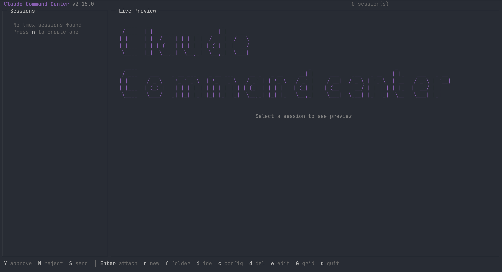
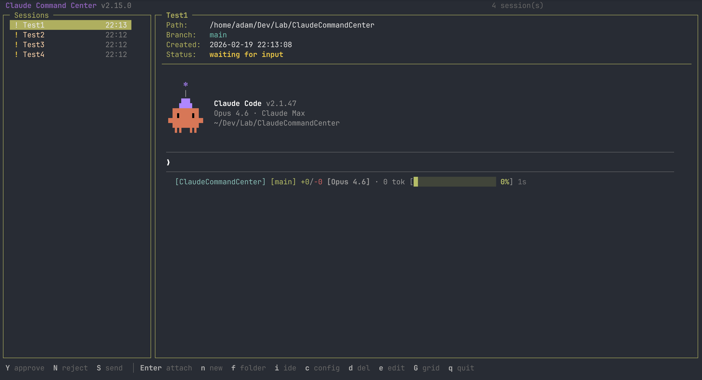
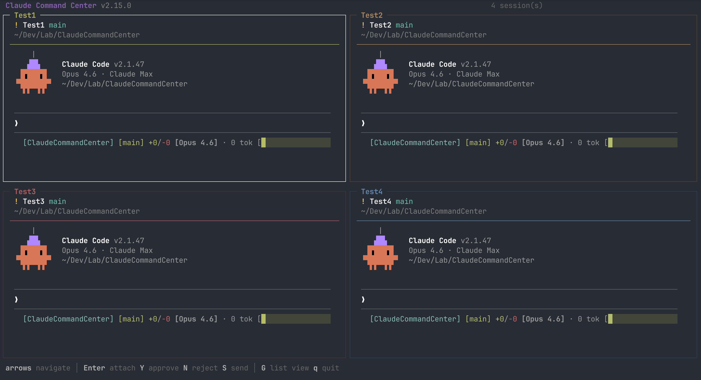

# Claude Command Center (ccc)






A terminal UI for managing multiple Claude Code sessions via tmux. Lists your sessions, shows a live preview of the selected pane, and highlights sessions waiting for input.

## Requirements

- [.NET 10](https://dotnet.microsoft.com/download) SDK or runtime
- [tmux](https://github.com/tmux/tmux)
- Linux or macOS (Windows via [WSL2](docs/WSL2-SETUP.md))

## Build

```bash
dotnet build
```

## Install

### From GitHub Release

Download and install the latest release automatically:

```bash
curl -fsSL https://raw.githubusercontent.com/AdamGardelov/ClaudeCommandCenter/main/install.sh | bash
```

This detects your platform (Linux, macOS Intel/ARM), downloads the latest release, and installs to `/usr/local/bin`. Windows users should run this inside WSL.

### From Source

Requires [.NET 10](https://dotnet.microsoft.com/download) SDK.

```bash
# Linux / WSL
dotnet publish -c Release -r linux-x64 --self-contained -p:PublishSingleFile=true -o dist

# macOS Apple Silicon
dotnet publish -c Release -r osx-arm64 --self-contained -p:PublishSingleFile=true -o dist

# macOS Intel
dotnet publish -c Release -r osx-x64 --self-contained -p:PublishSingleFile=true -o dist
```

Then copy to your PATH:

```bash
sudo cp dist/ccc /usr/local/bin/ccc
```

After installing, the `ccc` command is available from any terminal.

## Usage

Run outside of tmux:

```bash
ccc
```

The app shows a split-panel TUI — sessions on the left, a live pane preview on the right. Sessions that have been idle for a few seconds are marked with `!` (waiting for input).

### Grid View

Press `G` to toggle a grid view that displays all sessions as rich panels in an auto-scaling grid. Each cell shows the session name, status, git branch, working directory, and live pane output.

The grid auto-scales based on session count:

| Sessions | Layout | Output lines per cell |
|----------|--------|-----------------------|
| 1 | 1x1 | ~30 lines |
| 2 | 1x2 | ~15 lines |
| 3–4 | 2x2 | ~10 lines |
| 5–6 | 2x3 | ~5 lines |
| 7–9 | 3x3 | ~3 lines |
| 10+ | Falls back to list view |

Press `Enter` on a grid cell to attach directly to that session. Press `G` to switch back to list view.

### Keybindings

#### List View (default)

| Key | Action |
|-----|--------|
| `j` / `k` / arrows | Navigate sessions |
| `Enter` | Attach to selected session |
| `G` | Toggle grid view |
| `n` | Create new session (launches `claude` in a given directory) |
| `g` | Create new group |
| `f` | Open session directory in file manager |
| `i` | Open session directory in IDE |
| `c` | Open config file in IDE |
| `d` | Delete session (with confirmation) |
| `e` | Edit session (name, description, color) |
| `x` | Exclude/restore session from grid view |
| `m` | Move standalone session to a group |
| `r` | Refresh session list |
| `Y` | Approve — sends `y` to the selected session |
| `N` | Reject — sends `n` to the selected session |
| `S` | Send — type a message and send it to the selected session |
| `q` | Quit |

#### Grid View

| Key | Action |
|-----|--------|
| `↑` `↓` `←` `→` | Navigate grid cells |
| `Enter` | Attach to selected session |
| `G` | Back to list view |
| `Y` / `N` / `S` | Approve, reject, send (same as list view) |
| `q` | Quit |

Arrow keys always work for navigation regardless of configuration. When you attach to a session, detach with the standard tmux prefix (`Ctrl-b d`) to return to the command center.

### Configuration

Create `~/.ccc/config.json` to configure favorite folders. When creating a new session, you'll be able to pick from this list instead of typing a full path.

```json
{
  "favoriteFolders": [
    { "name": "Core", "path": "~/Dev/Wint/Core" },
    { "name": "Salary", "path": "~/Dev/Wint/Wint.Salary" }
  ],
  "ideCommand": "rider"
}
```

| Setting | Default | Description |
|---------|---------|-------------|
| `favoriteFolders` | `[]` | Quick-pick directories when creating sessions |
| `ideCommand` | `` | Command to run when pressing `i` (e.g. `rider`, `code`, `cursor`) |
| `sessionDescriptions` | `{}` | Display names shown under sessions in the preview panel |
| `sessionColors` | `{}` | Spectre Console color names for session panel borders |
| `keybindings` | `{}` | Keybinding overrides (see below) |

The config file is created automatically on first run. Tilde (`~`) paths are expanded automatically.

#### Keybinding Configuration

Override default keybindings by adding a `keybindings` object to your config. Only include the actions you want to change — missing entries keep their defaults.

```json
{
  "keybindings": {
    "approve": { "key": "y", "label": "yes" },
    "delete-session": { "enabled": false },
    "open-ide": { "key": "e", "label": "editor" }
  }
}
```

Each override supports three optional fields:

| Field | Type | Description |
|-------|------|-------------|
| `key` | `string` | Single char (`"n"`) or special key (`"Enter"`) |
| `enabled` | `bool` | `false` to disable the action (ignored for non-disableable actions) |
| `label` | `string` | Status bar text; empty string hides from the bar |

**Available actions:**

| Action ID | Default Key | Default Label | Can Disable |
|-----------|-------------|---------------|-------------|
| `navigate-up` | `k` | (hidden) | No |
| `navigate-down` | `j` | (hidden) | No |
| `approve` | `Y` | approve | Yes |
| `reject` | `N` | reject | Yes |
| `send-text` | `S` | send | Yes |
| `attach` | `Enter` | attach | Yes |
| `new-session` | `n` | new | Yes |
| `new-group` | `g` | group | Yes |
| `open-folder` | `f` | folder | Yes |
| `open-ide` | `i` | ide | Yes |
| `open-config` | `c` | config | Yes |
| `delete-session` | `d` | del | Yes |
| `edit-session` | `e` | edit | Yes |
| `toggle-exclude` | `x` | hide | Yes |
| `move-to-group` | `m` | move | Yes |
| `toggle-grid` | `G` | grid | Yes |
| `refresh` | `r` | (hidden) | Yes |
| `quit` | `q` | quit | No |

Arrow keys always work for navigation regardless of configuration.

**Adding a new keybinding (developer guide):** Add a default entry in `KeyBindingService.Defaults` and a case in `App.DispatchAction()`.
